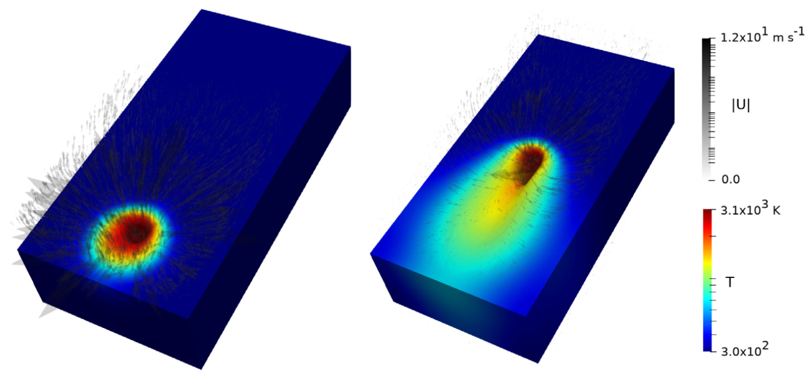

# beamWeldFoam

 

## Source code

[beamWeldFoam GitHub repository (OpenFOAM 6)](https://github.com/tomflint22/beamWeldFoam){:target="_blank"}  
[beamWeldFoam GitHub repository (OpenFOAM 10)](https://github.com/tomflint22/beamWeldFoam/tree/OF10){:target="_blank"} 

## Overview
Presented here is the extensible open-source volume-of-fluid (VOF) solver beamWeldFoam, for studying high energy density advanced manufacturing processes. In this implementation the metallic substrate, and shielding gas phase, are treated as in-compressible. The solver fully captures the fusion/melting state transition of the metallic substrate. For the vapourisation of the substrate, the explicit volumetric dilation due to the vapourisation state transition is neglected, instead, a phenomenological recoil pressure term is used to capture the contribution to the momentum and energy fields due to vaporisation events. beamWeldFoam also captures surface tension effects, the temperature dependence of surface tension (Marangoni) effects, latent heat effects due to melting/fusion (and vapourisation), buoyancy effects due to the thermal expansion of the phases using a Boussinesq approximation, momentum damping due to solidification, and a representative heat source description of an incident laser/electron beam heat source. The heat source can also be modified to be representative of arc-welding processes.
The solver approach is based on the adiabatic two-phase interFoam code developed by [OpenCFD Ltd.](http://openfoam.com/). Target applications for beamWeldFoam include:

* Laser Welding
* Electron Beam Welding
* Arc Welding
* Additive Manufacturing

