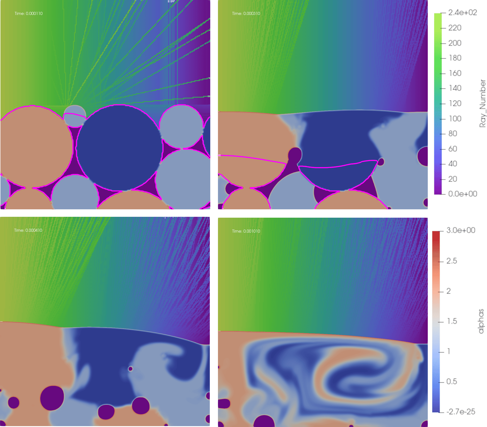

# laserbeamFoam

## Source code

[laserbeamFoam GitHub repository (OpenFOAM 10)](https://github.com/laserbeamfoam/LaserbeamFoam){:target="_blank"} 

## Overview
Presented here is a growing suite of solvers that describe laser-substrate interaction. This repository begins with the `laserbeamFoam` solver. Additional solvers are being added incrementally.

Currently, this repository contains:
### `laserbeamFoam`
A volume-of-fluid (VOF) solver for studying high energy density laser-based advanced manufacturing processes and laser-substrate interactions. This implementation treats the metallic substrate and shielding gas phase as in-compressible. The solver fully captures the metallic substrate's fusion/melting state transition. For the vapourisation of the substrate, the explicit volumetric dilation due to the vapourisation state transition is neglected; instead, a phenomenological recoil pressure term is used to capture the contribution to the momentum and energy fields due to vaporisation events. laserbeamFoam also captures surface tension effects, the temperature dependence of surface tension (Marangoni) effects, latent heat effects due to melting/fusion (and vapourisation), buoyancy effects due to the thermal expansion of the phases using a Boussinesq approximation, and momentum damping due to solidification.
A ray-tracing algorithm is implemented that permits the incident Gaussian laser beam to be discretised into several 'Rays' based on the computational grid resolution. The 'Rays' of this incident laser beam are then tracked through the domain through their multiple reflections, with the energy deposited by each ray determined through the Fresnel equations. The solver approach is extended from the adiabatic two-phase interFoam code developed by [OpenCFD Ltd.](http://openfoam.com/) to include non-isothermal state transition physics and ray-tracing heat source application.

### `arraylaserbeamFoam`

An extension of laserbeamFoam to N-laser sources that can each have their parameters set independently.

 Target applications for the solvers included in this repository include:

* Laser Welding
* Laser Drilling
* Laser Powder Bed Fusion
* Selective Laser Melting
* Diode Array Additive Manufacturing

### `multiComponentlaserbeamFoam`

An extension of the laserbeamfoam solver to multi-component metallic substrates. This solver can simulate M-Component metallic substrates in the presence of gas-phases. Diffusion is treated through a Fickian diffusion model with the diffusivity specified through 'diffusion pairs', and the interface compression is again specified pair-wise. The miscible phases in the simulation should have diffusivity specified between them, and immiscible phase pairs should have an interface compression term specified between them (typically 1).

Target applications for the solvers included in this repository include:

* Dissimilar Laser Welding
* Dissimilar Laser Drilling
* Dissimilar Laser Powder Bed Fusion
* Dissimilar Selective Laser Melting

