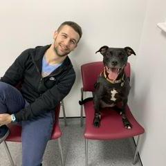
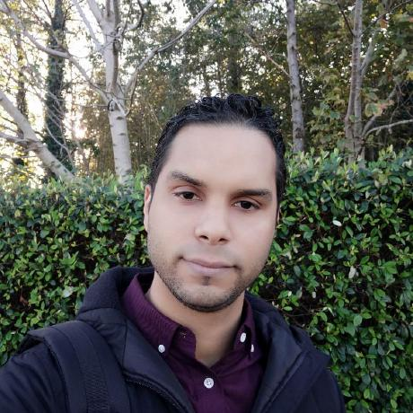

# Development team

---

## Tom Flint

 The University of Manchester / Henry Royce Institute  
 tom.flint@manchester.ac.uk  
 [tomflint22](https://github.com/tomflint22){:target="_blank"}    
 [0000-0002-0615-8621](https://orcid.org/0000-0002-0615-8621){:target="_blank"}   

---

## Philip Cardiff

 University College Dublin / I-Form  
 philip.cardiff@ucd.ie  
 [philipcardiff](https://github.com/philipcardiff){:target="_blank"}    
[0000-0002-4824-427X](https://orcid.org/0000-0002-4824-427X){:target="_blank"}   

---

## Petar Cosic

 University College Dublin / I-Form  
 petar.cosic.101@gmail.com  
 [cosicp](https://github.com/cosicp){:target="_blank"}   
  

---

## Simon Rodriguez

 University College Dublin / I-Form  
 simon.rodriguezluzardo@ucd.ie  
 [ScimonCFD](https://github.com/ScimonCFD){:target="_blank"}    
  

---
 
 